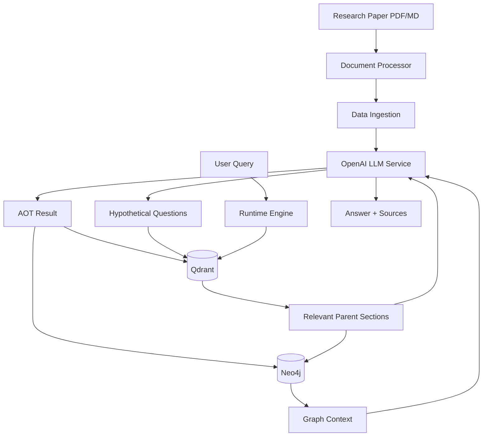
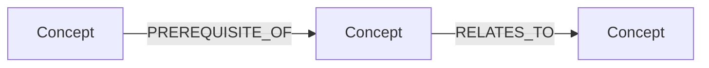
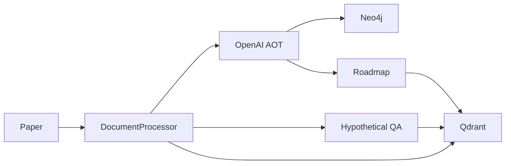
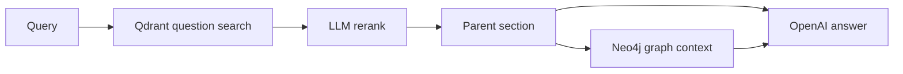
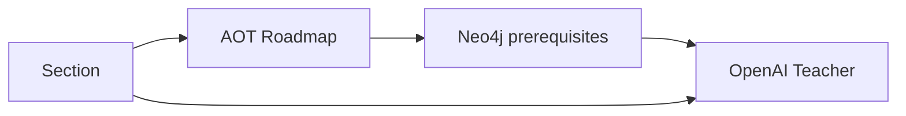

# RAG Research Helper — Simple Reference-First Rebuild Plan

> **Mục tiêu:** Làm lại `rag-research` theo đúng sản phẩm Research Paper Mentor/Helper đã chốt, nhưng code phải **đơn giản, thẳng, dễ đọc**, lấy `rag-expert-mentor` làm **code/architecture reference chính** thay vì thiết kế theo kiểu production.
>
> **Reference chính:** https://github.com/phongka79d/rag-expert-mentor
>
> **Model:** OpenAI API  
> **Vector DB:** Qdrant  
> **Graph DB:** Neo4j  
> **UI:** Streamlit  
> **Không dùng:** LangChain, LangGraph, DI framework, ports/adapters/contracts, microservices.

---

# 0. Quy tắc quan trọng nhất

Project này là **portfolio project**, không phải production platform.

Mục tiêu không phải:

```text
"build the most extensible architecture"
```

Mà là:

```text
"build the simplest codebase that still demonstrates
AOT + HyDE + Qdrant + Neo4j + Research Mentor"
```

Khi AI implement, phải tuân thủ:

```text
1. Reference-first:
   Trước khi viết module mới, đọc file tương ứng trong rag-expert-mentor.

2. Port/adapt trước, invent sau:
   Nếu code reference đã có flow phù hợp, adapt trực tiếp.

3. Không tạo abstraction nếu chỉ có 1 implementation.

4. Không tạo interface/protocol chỉ để "clean architecture".

5. Không chia 1 flow đơn giản thành 5 service class.

6. Runtime phải đọc từ trên xuống và hiểu được trong vài phút.

7. Không thêm feature ngoài scope tài liệu này.

8. Nếu có 2 cách:
   chọn cách có ít file, ít class, ít indirection hơn.

9. Qdrant làm semantic search.
   Neo4j làm concept relationships.
   Không trộn trách nhiệm.

10. Tests phải test behavior thực tế,
    không test abstraction ceremony.
```

---

# 1. Tại sao phải làm lại spec cũ

Spec cũ đúng về sản phẩm nhưng bắt đầu có dấu hiệu production hóa quá mức:

```text
schemas/
ingestion/
storage/
retrieval/
generation/
runtime/
llm/

vector_retriever
graph_retriever
hybrid_retriever
context_builder
graph gate
concept resolver
provider abstractions
manifest states
provenance objects
observability
multiple evaluation scripts
...
```

Với portfolio nhỏ, số layer này làm execution path khó nhìn hơn.

Spec cũ đã xác định đúng thesis:

```text
Expensive reasoning happens once at ingestion.
Runtime mostly executes precompiled knowledge.
```

và đúng stack:

```text
OpenAI + Qdrant + Neo4j
```

nhưng cấu trúc implementation cần đơn giản hóa mạnh.

Spec này **thay thế cách tổ chức code của spec cũ**, không thay đổi ý tưởng sản phẩm cốt lõi.

---

# 2. Học gì từ `rag-expert-mentor`

Repo reference có architecture nghe phức tạp, nhưng các flow quan trọng lại rất trực tiếp.

README:

https://github.com/phongka79d/rag-expert-mentor

Các file phải đọc trước khi implement:

## 2.1 Document parsing

[`database/document_processor.py`](https://github.com/phongka79d/rag-expert-mentor/blob/main/database/document_processor.py)

Học:

```text
document
→ sections
→ section metadata
→ stable ordering
```

Không cần copy assumptions về math textbook.

Adapt sang:

```text
research paper PDF/Markdown
→ sections
```

---

## 2.2 AOT ingestion

[`core/data_ingestion.py`](https://github.com/phongka79d/rag-expert-mentor/blob/main/core/data_ingestion.py)

Đây là **file reference quan trọng nhất**.

Flow reference thực tế:

```text
for each section
    ↓
extract_section_curriculum_and_dag()
    ↓
main_entities
teaching_roadmap
knowledge_graph
    ↓
save graph → Neo4j
    ↓
save roadmap → Qdrant
    ↓
generate_hypothetical_questions(raw section)
    ↓
save parent section → Qdrant
    ↓
save question children → Qdrant
```

Project mới phải giữ flow gần như vậy.

Không tạo thêm:

```text
CompilerPipeline
ArtifactWriter
PersistenceCoordinator
VectorPersistenceService
GraphPersistenceService
IngestionTransactionManager
```

Chỉ cần một `data_ingestion.py`.

---

## 2.3 LLM/AOT methods

[`orchestrator/llm_service.py`](https://github.com/phongka79d/rag-expert-mentor/blob/main/orchestrator/llm_service.py)

Ba pattern cần adapt:

```text
extract_section_curriculum_and_dag()
generate_hypothetical_questions()
rerank_candidate_questions()
```

Project mới đổi naming theo research domain:

```text
extract_section_plan_and_graph()
generate_hypothetical_questions()
rerank_candidate_questions()
```

Reference dùng LangChain.

Project mới:

```text
KHÔNG dùng LangChain.
```

Thay bằng:

```text
official OpenAI Python SDK
+
Pydantic validation
```

---

## 2.4 Qdrant parent-child retrieval

[`database/structural_db.py`](https://github.com/phongka79d/rag-expert-mentor/blob/main/database/structural_db.py)

Các function/pattern phải lấy làm cơ sở:

```text
upsert_section()
upsert_questions()
upsert_curriculum_group()
search_candidates_and_fetch_parent()
```

Đặc biệt giữ nguyên concept:

```text
Parent
    full research paper section

Child
    hypothetical question
    parent_id -> Parent
```

Runtime:

```text
query
→ search child questions
→ LLM rerank
→ parent_id
→ fetch full parent section
```

Không cần `VectorRetriever`, `HybridRetriever`, `ContextBuilder` riêng.

Qdrant store tự làm flow này như reference.

---

## 2.5 Neo4j

[`database/semantic_dag.py`](https://github.com/phongka79d/rag-expert-mentor/blob/main/database/semantic_dag.py)

Chỉ adapt các phần:

```text
save_knowledge_graph()
get_graph_context()
get_concept_subgraph()
get_visual_graph()
```

Không lấy:

```text
User
ChatTurn
HAS_LEARNED
HAS_TURN
NEXT_TURN
DISCUSSED
chat memory
episodic memory
user state
```

Neo4j của project mới chỉ là **research concept graph**.

---

## 2.6 Runtime

[`runtime/engine.py`](https://github.com/phongka79d/rag-expert-mentor/blob/main/runtime/engine.py)

Chỉ học cách:

```text
engine
→ gọi DB
→ gọi LLM
→ merge context
→ trả output
```

Không port:

```text
memory routing
agent queue
scratchpad
user persistence
dynamic queue mutation
```

Project mới phải có runtime nhỏ hơn reference rất nhiều.

---

## 2.7 Docker / Neo4j setup

[`docker-compose.yml`](https://github.com/phongka79d/rag-expert-mentor/blob/main/docker-compose.yml)

Reference đang cấu hình trực tiếp `NEO4J_AUTH` trong compose.

Project mới **không hardcode password trong git**.

Phải chuyển credential sang `.env`.

Chi tiết ở Section 14.

---

# 3. Sản phẩm cuối cùng là gì?

Tên tạm:

```text
RAG Research Helper
```

User upload một nhóm research paper AI/ML.

System làm 3 việc chính:

```text
1. ASK
   hỏi paper / nhiều paper

2. TEACH
   học từng section theo roadmap đã compile từ trước

3. GRAPH
   xem concept và quan hệ giữa các paper
```

Không cần một `Compare` mode riêng.

Ví dụ:

```text
"Compare LoRA and QLoRA"
```

chỉ là một query của ASK.

Không cần một `Evaluation` tab riêng.

Evaluation là script cho portfolio.

---

# 4. Scope mới — chỉ giữ những gì thật sự cần

## 4.1 MUST HAVE

```text
[1] PDF/Markdown ingestion
[2] Section parsing
[3] AOT extraction
[4] Learning roadmap
[5] Knowledge graph extraction
[6] Hypothetical questions
[7] OpenAI embeddings
[8] Qdrant parent-child storage
[9] Qdrant HyDE retrieval
[10] LLM reranking
[11] Neo4j concept graph
[12] Graph context lookup
[13] Ask
[14] Teach section
[15] Graph visualization
[16] Source citations
[17] Minimal retrieval evaluation
[18] Streamlit UI
```

---

## 4.2 Không làm

```text
NO LangChain
NO LangGraph

NO ports/
NO adapters/
NO contracts.py
NO interfaces.py
NO infrastructure.py
NO wiring.py
NO repositories/
NO provider factory
NO DI container

NO multi-agent
NO queue
NO blackboard
NO scratchpad
NO reflection
NO planner

NO long-term chat memory
NO Neo4j user state
NO semantic memory
NO episodic memory

NO graph router LLM
NO graph gate service
NO concept resolver service
NO secondary vector retrieval pipeline
NO hybrid retriever class
NO context builder class

NO Paper/Section nodes trong Neo4j
NO author graph
NO citation graph

NO compiler version framework
NO schema migration framework
NO ingestion transaction manifest
NO provenance model
NO observability framework

NO Celery
NO Redis
NO Kafka
NO FastAPI
NO Kubernetes

NO generic multi-provider LLM layer
NO local LLM
NO local embedding model
```

Nếu AI tự tạo các file này mà không có lý do bắt buộc:

```text
STOP
DELETE
SIMPLIFY
```

---

# 5. Architecture mới



Điểm quan trọng:

```text
Không có:
Router layer
Retriever layer
Service layer
Adapter layer
Contract layer
```

---

# 6. Project structure

Phải cố tình giống sự đơn giản của repo reference.

```text
rag-research-helper/
│
├── main.py
├── setup_env.py
│
├── core/
│   ├── __init__.py
│   ├── schemas.py
│   └── data_ingestion.py
│
├── database/
│   ├── __init__.py
│   ├── document_processor.py
│   ├── structural_db.py
│   └── semantic_dag.py
│
├── orchestrator/
│   ├── __init__.py
│   └── llm_service.py
│
├── runtime/
│   ├── __init__.py
│   └── engine.py
│
├── config/
│   ├── __init__.py
│   └── settings.py
│
├── data/
│   ├── papers/
│   └── eval.json
│
├── tests/
│   ├── test_ingestion.py
│   ├── test_qdrant.py
│   ├── test_neo4j.py
│   └── test_runtime.py
│
├── evaluate.py
├── docker-compose.yml
├── requirements.txt
├── .env.example
├── .gitignore
└── README.md
```

Khoảng:

```text
10–15 source files
```

là đủ.

Không tạo `src/research_mentor/...` với quá nhiều nested package.

---

# 7. Trách nhiệm từng file

## `main.py`

Chỉ làm Streamlit UI + khởi tạo dependencies.

```python
settings = Settings()

llm = LLMService(settings)
db = QdrantVectorStore(settings, llm)
dag = Neo4jManager(settings)
engine = RuntimeEngine(llm, db, dag)
```

Không có factory/wiring/container.

UI:

```text
Sidebar:
- Upload/Ingest paper
- Paper filter

Tabs:
- Ask
- Teach
- Graph
```

---

## `core/schemas.py`

Tất cả schema nhỏ để chung một file.

Không tách:

```text
document.py
compiler.py
graph.py
retrieval.py
teaching.py
```

Các schema cần:

```python
class GraphNode(BaseModel):
    name: str
    description: str = ""


class GraphEdge(BaseModel):
    source: str
    target: str
    relation: str


class RoadmapStep(BaseModel):
    seq_id: int
    title: str
    content_focus: str
    concepts: list[str] = []


class SectionAOTResult(BaseModel):
    main_entities: list[str]
    learning_roadmap: list[RoadmapStep]
    knowledge_graph: dict


class HypotheticalQA(BaseModel):
    question: str
    key_knowledge: str
```

Không cần `CompiledSection` object quá lớn.

---

## `database/document_processor.py`

Adapt trực tiếp pattern của:

https://github.com/phongka79d/rag-expert-mentor/blob/main/database/document_processor.py

Input:

```text
PDF
Markdown
```

Output:

```python
{
    "page_content": "...",
    "metadata": {
        "source": "...",
        "section": "...",
        "seq_id": 0,
        "page_start": 1,
        "page_end": 2,
    }
}
```

Giữ data shape gần reference để port ingestion code dễ.

Không cần tạo domain object graph cho `Paper` và `Section`.

### PDF parsing

Dùng:

```text
pypdf
```

V1 chỉ cần best-effort text extraction.

Không thêm:

```text
GROBID
Docling
Marker
OCR pipeline
layout model
```

---

# 8. AOT ingestion — giữ gần reference nhất

File:

```text
core/data_ingestion.py
```

Reference:

https://github.com/phongka79d/rag-expert-mentor/blob/main/core/data_ingestion.py

Project mới nên gần như đọc được theo cùng flow:

```python
def ingest_document(file_path):
    sections = processor.process(file_path)

    existing_nodes = dag.get_all_concept_names()

    for section in sections:
        full_text = section["page_content"]
        metadata = section["metadata"]

        parent_id = make_parent_id(metadata)

        if db.section_exists(parent_id):
            continue

        # 1. AOT
        aot = llm.extract_section_plan_and_graph(
            full_text,
            existing_nodes=existing_nodes,
        )

        # 2. Update global concept names
        for node in aot["knowledge_graph"]["nodes"]:
            if node["name"] not in existing_nodes:
                existing_nodes.append(node["name"])

        # 3. Neo4j
        dag.save_knowledge_graph(
            nodes=aot["knowledge_graph"]["nodes"],
            edges=aot["knowledge_graph"]["edges"],
            source=metadata,
            main_entities=aot["main_entities"],
        )

        # 4. Roadmap → Qdrant
        for idx, step in enumerate(aot["learning_roadmap"]):
            step["seq_id"] = idx

            db.upsert_roadmap_step(
                step,
                parent_id=parent_id,
                metadata=metadata,
            )

        # 5. Hypothetical questions FROM RAW SECTION
        questions = llm.generate_hypothetical_questions(
            full_text,
            num_questions=5,
        )

        # 6. Parent
        parent_metadata = {
            **metadata,
            "main_entities": aot["main_entities"],
            "anchor_nodes": collect_anchor_nodes(aot),
        }

        db.upsert_section(
            full_text,
            parent_metadata,
            parent_id,
        )

        # 7. Children
        db.upsert_questions(
            questions,
            parent_id,
            metadata["source"],
        )
```

Đây là toàn bộ ingestion orchestration.

Không cần thêm layer.

---

# 9. AOT output

Giữ rất gần reference.

Một OpenAI call:

```json
{
  "main_entities": [
    "Low-Rank Adaptation",
    "Transformer Fine-Tuning"
  ],
  "learning_roadmap": [
    {
      "title": "Why full fine-tuning is expensive",
      "content_focus": "Motivation behind parameter-efficient fine-tuning",
      "concepts": ["Full Fine-Tuning", "Parameter Efficiency"]
    },
    {
      "title": "How LoRA works",
      "content_focus": "Low-rank update matrices and frozen base weights",
      "concepts": ["LoRA", "Low-Rank Matrix"]
    }
  ],
  "knowledge_graph": {
    "nodes": [
      {
        "name": "LoRA",
        "description": "Low-rank adaptation technique"
      },
      {
        "name": "Low-Rank Matrix",
        "description": "Low-dimensional matrix factorization"
      }
    ],
    "edges": [
      {
        "source": "Low-Rank Matrix",
        "relation": "PREREQUISITE_OF",
        "target": "LoRA"
      }
    ]
  }
}
```

Không thêm:

```text
question_types
confidence
provenance object
compiler model version
schema version
strategy enums
separate prerequisites field
recommended sections
```

Prerequisite đã nằm trong graph edge.

---

# 10. Relation types — giữ giống reference

Không cần 6–10 relation types.

Dùng đúng 4 loại đủ dùng:

```text
PREREQUISITE_OF
RELATES_TO
PART_OF
DESCRIBES
```

Lợi ích:

```text
simple prompt
simple Cypher
simple graph
less noisy extraction
```

Nếu LLM trả relation khác:

```text
map → RELATES_TO
```

---

# 11. Qdrant — gần như port reference

File:

```text
database/structural_db.py
```

Reference:

https://github.com/phongka79d/rag-expert-mentor/blob/main/database/structural_db.py

## Collections

Chỉ 2 collection:

```text
research_curriculum
research_questions
```

### `research_curriculum`

Chứa 2 loại point:

```text
type=section_anchor
type=roadmap_step
```

### `research_questions`

Chứa:

```text
type=question
parent_id
```

Giống cách reference tổ chức `math_curriculum_v4` và question collection.

---

## Các method cần

```python
class QdrantVectorStore:
    def ensure_collections(self):
        ...

    def section_exists(self, parent_id: str) -> bool:
        ...

    def upsert_section(self, text, metadata, parent_id):
        ...

    def upsert_questions(self, qa_pairs, parent_id, source_file):
        ...

    def upsert_roadmap_step(self, step, parent_id, metadata):
        ...

    def search_candidates_and_fetch_parent(
        self,
        query,
        llm_service,
        target_file="",
    ):
        ...

    def get_section_exact(self, target_file, target_section):
        ...

    def get_roadmap(self, parent_id):
        ...
```

Không cần generic CRUD.

---

## Parent ID

Giữ đơn giản như reference.

Ví dụ:

```python
parent_id = md5(
    f"{source_file}__{section_name}".encode()
).hexdigest()
```

Không cần UUID namespace/domain ID framework.

Question child:

```python
uuid.uuid5(
    uuid.NAMESPACE_DNS,
    f"{parent_id}_q_{idx}"
)
```

Roadmap step:

```python
uuid.uuid5(
    uuid.NAMESPACE_DNS,
    f"{parent_id}_step_{idx}"
)
```

---

# 12. Retrieval — không tạo `retrieval/` package

Reference method:

https://github.com/phongka79d/rag-expert-mentor/blob/main/database/structural_db.py

Core flow:

```text
User query
   ↓
OpenAI embedding
   ↓
Qdrant research_questions top 5
   ↓
LLM rerank candidates
   ↓
best 1–2 parent_id
   ↓
fetch full section
```

Project mới giữ đúng flow đó.

Pseudo:

```python
def search_candidates_and_fetch_parent(query, llm_service, target_file=""):
    vector = llm_service.embed(query)

    results = qdrant.search(
        collection="research_questions",
        vector=vector,
        filter=target_file,
        limit=5,
    )

    candidates = [
        {
            "question": ...,
            "parent_id": ...,
            "key_knowledge": ...,
        }
        for result in results
    ]

    parent_ids = llm_service.rerank_candidate_questions(
        query,
        candidates,
    )[:2]

    return fetch_parent_sections(parent_ids)
```

Không cần:

```text
VectorRetriever
HybridRetriever
RerankerService
ContextBuilder
RetrievedSection domain model
```

`LLMService` rerank.
`QdrantVectorStore` retrieve.

Hết.

---

# 13. Neo4j — đơn giản hơn spec cũ rất nhiều

File:

```text
database/semantic_dag.py
```

Reference:

https://github.com/phongka79d/rag-expert-mentor/blob/main/database/semantic_dag.py

## Chỉ dùng `Concept`

Không tạo:

```text
Paper node
Section node
User node
ChatTurn node
```

Schema:



Concept properties:

```text
id
description
source_locators[]
is_main
```

Ví dụ:

```json
{
  "id": "LoRA",
  "description": "Low-rank adaptation method",
  "source_locators": [
    "lora.pdf::Method",
    "qlora.pdf::Background"
  ],
  "is_main": true
}
```

Đây chính là cách phù hợp để một concept liên kết nhiều paper mà không cần `Paper`/`Section` node.

---

## Neo4j methods cần

```python
class Neo4jManager:
    def __init__(self, uri, user, password):
        ...

    def verify_connection(self):
        ...

    def get_all_concept_names(self):
        ...

    def save_knowledge_graph(
        self,
        nodes,
        edges,
        source,
        main_entities,
    ):
        ...

    def get_graph_context(
        self,
        node_names,
        search_mode="search",
    ):
        ...

    def get_concept_subgraph(
        self,
        target_concept,
        max_depth=2,
    ):
        ...

    def get_visual_graph(self, locator=None):
        ...

    def close(self):
        ...
```

Đủ.

---

## Graph search

Giữ logic reference:

### Semi-search

```text
1 hop backward
```

cho Teach/current section.

### Search

```text
1–2 hops undirected
```

cho Ask.

Không có graph gate.

Không có graph-guided second vector search.

Runtime chỉ lấy graph context rồi đưa cùng parent text cho LLM.

---

# 14. Neo4j password — BẮT BUỘC xử lý đúng

Đây là requirement cứng.

Reference repo hardcode `NEO4J_AUTH` trong `docker-compose.yml`.

Project mới **không được hardcode password vào source control**.

## 14.1 `.env`

Actual `.env`:

```env
OPENAI_API_KEY=...

OPENAI_MODEL=gpt-5
OPENAI_EMBEDDING_MODEL=text-embedding-3-small
OPENAI_EMBEDDING_DIM=1536

QDRANT_URL=http://localhost:6333

NEO4J_URI=bolt://localhost:7687
NEO4J_USER=neo4j
NEO4J_PASSWORD=<ACTUAL_VERIFIED_PASSWORD>
```

`.env` phải nằm trong:

```text
.gitignore
```

---

## 14.2 `.env.example`

Commit file này:

```env
OPENAI_API_KEY=

OPENAI_MODEL=gpt-5
OPENAI_EMBEDDING_MODEL=text-embedding-3-small
OPENAI_EMBEDDING_DIM=1536

QDRANT_URL=http://localhost:6333

NEO4J_URI=bolt://localhost:7687
NEO4J_USER=neo4j
NEO4J_PASSWORD=
```

Không commit password thật.

---

## 14.3 `docker-compose.yml`

Phải đọc credential từ `.env`:

```yaml
services:
  qdrant:
    image: qdrant/qdrant:latest
    container_name: rag_research_qdrant
    ports:
      - "6333:6333"
      - "6334:6334"
    volumes:
      - ./database/docker_volumes/qdrant:/qdrant/storage

  neo4j:
    image: neo4j:5
    container_name: rag_research_neo4j
    ports:
      - "7474:7474"
      - "7687:7687"
    environment:
      NEO4J_AUTH: "${NEO4J_USER}/${NEO4J_PASSWORD}"
    volumes:
      - ./database/docker_volumes/neo4j_data:/data
```

Không cần APOC ở lần build đầu.

Chỉ thêm APOC nếu code thực sự dùng APOC.

Normal Cypher là đủ cho scope này.

---

# 15. `setup_env.py` — chỉ utility cần thiết

Đây là utility duy nhất đáng thêm ngoài reference structure vì user yêu cầu credential phải được check.

File:

```text
setup_env.py
```

Nhiệm vụ:

```text
1. Load/create .env
2. Check Neo4j credential
3. Put actual password into .env
4. Verify connectivity
```

Không phải config framework.

---

## 15.1 Case A — `.env` đã có password

```text
NEO4J_PASSWORD exists
        ↓
connect Neo4j
        ↓
driver.verify_connectivity()
        ↓
success
```

Nếu fail:

```text
do not continue
show clear error
```

Không fallback silently.

---

## 15.2 Case B — `.env` chưa có password nhưng container đang tồn tại

Script có thể kiểm tra local Docker container:

```bash
docker inspect rag_research_neo4j
```

Đọc `NEO4J_AUTH` từ container environment nếu credential khởi tạo vẫn còn ở đó.

Nếu tìm được:

```text
neo4j/<password>
```

thì:

```text
extract password
→ write/update NEO4J_PASSWORD in .env
→ verify Neo4j connection
```

**Không print password ra terminal/log.**

---

## 15.3 Case C — fresh setup, chưa có Neo4j data

Nếu:

```text
no .env password
no existing Neo4j container/data
```

thì script:

```python
password = secrets.token_urlsafe(18)
```

ghi:

```text
NEO4J_PASSWORD=<generated>
```

vào `.env`.

Sau đó user chạy:

```bash
docker compose up -d
```

hoặc setup script có thể gọi compose nếu muốn.

Sau khi Neo4j start:

```python
driver.verify_connectivity()
```

phải pass.

---

## 15.4 Case D — existing Neo4j data nhưng không recover được password

Không được:

```text
guess password
reset database automatically
delete volume
generate new password and pretend it works
```

Phải stop:

```text
Existing Neo4j data detected but password cannot be verified.
Provide/reset the Neo4j password, then rerun setup.
```

Điều này quan trọng vì Neo4j password đã lưu dạng auth state trong persistent data, không phải lúc nào cũng đọc ngược ra được.

---

## 15.5 `.env` writer đơn giản

Không cần library config editor.

Có thể dùng:

```python
from pathlib import Path


def set_env_value(key: str, value: str):
    ...
```

hoặc `python-dotenv`:

```python
from dotenv import set_key

set_key(".env", "NEO4J_PASSWORD", password)
```

Project đã cần `python-dotenv` để load env nên dùng luôn.

---

## 15.6 Startup check

`Neo4jManager.__init__()` không cần làm phức tạp.

Nhưng khi app start:

```python
dag = Neo4jManager(...)

dag.verify_connection()
```

Nếu password sai:

```text
raise clear configuration error
```

Không silently disable graph.

Vì Neo4j là core feature của sản phẩm này.

---

# 16. OpenAI service — 1 file

File:

```text
orchestrator/llm_service.py
```

Không tạo:

```text
openai_client.py
embedding_client.py
generation_client.py
provider.py
factory.py
```

Một class:

```python
class LLMService:
    def __init__(self, settings):
        self.client = OpenAI(
            api_key=settings.OPENAI_API_KEY
        )

    def embed(self, text: str) -> list[float]:
        ...

    def embed_many(self, texts: list[str]) -> list[list[float]]:
        ...

    def extract_section_plan_and_graph(
        self,
        section_text: str,
        existing_nodes: list[str],
    ) -> dict:
        ...

    def generate_hypothetical_questions(
        self,
        section_text: str,
        num_questions: int = 5,
    ) -> list[dict]:
        ...

    def rerank_candidate_questions(
        self,
        user_query: str,
        candidates: list[dict],
    ) -> list[str]:
        ...

    def answer(
        self,
        query: str,
        sections: list[dict],
        graph_context: list[dict],
    ) -> str:
        ...

    def teach_step(
        self,
        section_text: str,
        roadmap_step: dict,
        graph_context: list[dict],
    ) -> str:
        ...
```

Hết.

OpenAI official references:

- https://platform.openai.com/docs/quickstart
- https://platform.openai.com/docs/api-reference/responses
- https://platform.openai.com/docs/api-reference/embeddings

Generation:

```text
Responses API
```

Embeddings:

```text
Embeddings API
```

---

# 17. Runtime Ask — 1 flow thẳng

File:

```text
runtime/engine.py
```

Pseudo:

```python
class RuntimeEngine:
    def __init__(self, llm, db, dag):
        self.llm = llm
        self.db = db
        self.dag = dag

    def ask(self, query: str, target_file: str = ""):
        # 1. HyDE search + rerank + parent fetch
        sections = self.db.search_candidates_and_fetch_parent(
            query=query,
            llm_service=self.llm,
            target_file=target_file,
        )

        if not sections:
            return {
                "answer": "No relevant source found.",
                "sources": [],
            }

        # 2. Collect anchor concepts stored with parents
        anchors = collect_anchor_nodes(sections)

        # 3. Get graph context
        graph_context = self.dag.get_graph_context(
            anchors,
            search_mode="search",
        )

        # 4. Generate grounded answer
        answer = self.llm.answer(
            query=query,
            sections=sections,
            graph_context=graph_context,
        )

        return {
            "answer": answer,
            "sources": build_sources(sections),
            "graph_context": graph_context,
        }
```

Đây là core runtime.

Không cần thêm class.

---

# 18. Ask scope

Chỉ giữ 2 scope:

```text
Current paper
All papers
```

Không cần:

```text
Current section
Current paper
All papers
scope router
```

Nếu current paper:

```text
target_file=<paper>
```

Nếu all:

```text
target_file=""
```

Reference Qdrant method đã có pattern filter `target_file`.

---

# 19. Compare là Ask

User hỏi:

```text
Compare LoRA and QLoRA
```

System không vào `CompareEngine`.

Nó chỉ:

```text
HyDE search
→ top parent sections có thể đến từ LoRA + QLoRA
→ graph context
→ answer prompt nhận instruction:
   if query is comparative, answer comparatively
```

Không tạo:

```text
generation/compare.py
compare service
compare route
```

---

# 20. Teacher — giữ AOT roadmap, bỏ multi-agent

Teacher là phần sản phẩm khác Ask nhưng vẫn rất đơn giản.

User flow:

```text
select paper
→ select section
→ Teach this section
```

Runtime:

```text
1. get full section
2. get AOT roadmap steps
3. iterate roadmap
4. for each step:
     get graph context
     call OpenAI teacher prompt
5. show step-by-step lesson
```

Pseudo:

```python
def teach_section(self, target_file, target_section):
    sections = self.db.get_section_exact(
        target_file,
        target_section,
    )

    if not sections:
        return []

    section = sections[0]
    parent_id = section["metadata"]["parent_id"]

    roadmap = self.db.get_roadmap(parent_id)

    lessons = []

    for step in roadmap:
        concepts = step["metadata"].get("concepts", [])

        graph_context = self.dag.get_graph_context(
            concepts,
            search_mode="semi_search",
        )

        text = self.llm.teach_step(
            section_text=section["page_content"],
            roadmap_step=step,
            graph_context=graph_context,
        )

        lessons.append({
            "step": step,
            "content": text,
        })

    return lessons
```

Không có:

```text
TeacherAgent
TeachingSessionManager
LearningPlanner
TopologicalSorter
Strategy classes
Agent registry
```

AOT roadmap là planner.

---

# 21. Graph UI

Graph tab chỉ cần:

```text
paper/section selector
→ get_visual_graph(locator)
→ render nodes/edges
```

Có thể dùng:

```text
pyvis
```

hoặc Streamlit-compatible component đơn giản.

Nếu graph visualization làm tốn thời gian:

```text
show table/list nodes + edges trước
```

UI đẹp không được ưu tiên hơn retrieval.

---

# 22. Citation

Mỗi Qdrant parent section đã có metadata:

```text
source
section
page_start
page_end
```

Final source:

```text
[LoRA — Method, p.4–5]
```

Không cần `Citation` class.

Function:

```python
def build_sources(sections):
    ...
```

là đủ.

---

# 23. Settings — đơn giản

File:

```text
config/settings.py
```

Dùng:

```python
import os
from dotenv import load_dotenv

load_dotenv()


class Settings:
    OPENAI_API_KEY = os.getenv("OPENAI_API_KEY", "")
    OPENAI_MODEL = os.getenv("OPENAI_MODEL", "gpt-5")

    OPENAI_EMBEDDING_MODEL = os.getenv(
        "OPENAI_EMBEDDING_MODEL",
        "text-embedding-3-small",
    )

    OPENAI_EMBEDDING_DIM = int(
        os.getenv("OPENAI_EMBEDDING_DIM", "1536")
    )

    QDRANT_URL = os.getenv(
        "QDRANT_URL",
        "http://localhost:6333",
    )

    NEO4J_URI = os.getenv(
        "NEO4J_URI",
        "bolt://localhost:7687",
    )

    NEO4J_USER = os.getenv(
        "NEO4J_USER",
        "neo4j",
    )

    NEO4J_PASSWORD = os.getenv(
        "NEO4J_PASSWORD",
        "",
    )
```

Không cần `BaseSettings` nếu không mang lại lợi ích.

Có thể thêm:

```python
def validate(self):
    if not self.OPENAI_API_KEY:
        raise RuntimeError(...)
    if not self.NEO4J_PASSWORD:
        raise RuntimeError(...)
```

---

# 24. Dependencies

`requirements.txt`:

```text
openai
qdrant-client
neo4j
pydantic
python-dotenv
pypdf
streamlit
pytest
```

Optional graph visualization:

```text
pyvis
```

Không thêm:

```text
langchain
langgraph
dependency-injector
ragas
fastapi
celery
redis
```

RAGAS chỉ thêm sau nếu thực sự muốn nâng evaluation.

---

# 25. Evaluation — 1 script, không làm framework

File:

```text
evaluate.py
```

Dataset:

```text
data/eval.json
```

Khoảng:

```text
20–30 questions
```

Categories:

```text
factual
conceptual
relational
cross-paper
```

Không cần 6 category ngay.

---

## Metrics

Chỉ cần:

```text
Recall@5
MRR
```

Optional:

```text
manual answer score
```

Không cần initial V1:

```text
RAGAS
faithfulness pipeline
citation metric framework
latency tracing framework
multiple result schemas
```

---

## Minimal ablation

Trong cùng `evaluate.py`, chạy:

```text
A. parent section vector baseline
B. hypothetical question + rerank
C. hypothetical question + rerank + graph context
```

Lưu:

```text
eval_results.json
```

Một script đủ.

---

# 26. Tests — chỉ test core behavior

Không chia:

```text
unit/
integration/
contract/
e2e/
evaluation/
```

Chỉ:

```text
tests/
```

---

## `test_ingestion.py`

Test:

```text
section parser works
AOT result validates
parent ID deterministic
```

---

## `test_qdrant.py`

Test:

```text
upsert parent
upsert children
query child
resolve parent
```

---

## `test_neo4j.py`

Test:

```text
verify connection
save concept
save relation
1-hop graph context
concept subgraph
```

---

## `test_runtime.py`

Test:

```text
Ask returns answer + sources
Teach returns roadmap steps
```

Tối đa ~4 test file ban đầu.

---

# 27. Error handling — đơn giản

Không cần custom exception hierarchy.

Ví dụ:

```python
try:
    ...
except Exception as e:
    logger.exception(...)
    raise
```

Hoặc ở UI boundary:

```python
try:
    result = engine.ask(...)
except Exception as e:
    st.error(str(e))
```

Không silently fallback Neo4j nếu credential sai.

Không tạo:

```text
InfrastructureError
StorageError
GraphUnavailableError
RetryPolicy
CircuitBreaker
```

---

# 28. Logging

Dùng Python `logging`.

```python
import logging

logger = logging.getLogger(__name__)
```

Không:

```text
OpenTelemetry
LangSmith
custom trace object
event bus
```

Nếu cần đo evaluation latency:

```python
start = time.perf_counter()
```

trong `evaluate.py`.

---

# 29. Ingestion cache — đơn giản

Không cần compiler/schema version manager.

Dùng:

```text
section_exists(parent_id)
```

Nếu section đã có:

```text
skip
```

CLI/UI có:

```text
force_reingest=True
```

nếu muốn rebuild.

Nếu sau này đổi prompt:

```text
force re-ingest
```

Portfolio không cần migration framework.

---

# 30. Factual retrieval concern

Hypothetical questions **phải được generate từ RAW SECTION TEXT**.

Đây là requirement.

Không generate questions chỉ từ summary.

Ví dụ section chứa:

```text
learning rate = 3e-4
batch size = 256
```

Hypothetical QA prompt phải được phép tạo:

```text
What learning rate was used?
What batch size did the authors use?
```

Như vậy child-only retrieval của reference vẫn có khả năng bắt factual query.

Nếu evaluation sau đó cho thấy factual Recall@5 vẫn kém:

```text
THEN
add simple parent-vector fallback
```

Không thêm ngay.

---

# 31. Cross-paper behavior

Cross-paper không cần architecture riêng.

AOT:

```text
Paper A concept: Transformer
Paper B concept: Transformer
```

Neo4j:

```text
MERGE Concept(id="Transformer")
```

Concept node có:

```text
source_locators = [
    "paper_a::section_x",
    "paper_b::section_y"
]
```

Qdrant:

```text
question search across all papers
```

User:

```text
How does QLoRA extend LoRA?
```

Qdrant có thể trả:

```text
LoRA parent
QLoRA parent
```

Neo4j enrich relation.

Hết.

---

# 32. Simplified data flow

## Ingestion



---

## Ask



---

## Teach



---

# 33. Reference-to-new-code mapping

| New project | Reference | Action |
|---|---|---|
| `database/document_processor.py` | [`database/document_processor.py`](https://github.com/phongka79d/rag-expert-mentor/blob/main/database/document_processor.py) | Adapt |
| `core/data_ingestion.py` | [`core/data_ingestion.py`](https://github.com/phongka79d/rag-expert-mentor/blob/main/core/data_ingestion.py) | **Follow closely** |
| `core/schemas.py` | [`core/schemas.py`](https://github.com/phongka79d/rag-expert-mentor/blob/main/core/schemas.py) | Simplify |
| `orchestrator/llm_service.py` | [`orchestrator/llm_service.py`](https://github.com/phongka79d/rag-expert-mentor/blob/main/orchestrator/llm_service.py) | Adapt 3 core methods, remove LangChain |
| `database/structural_db.py` | [`database/structural_db.py`](https://github.com/phongka79d/rag-expert-mentor/blob/main/database/structural_db.py) | **Port/adapt parent-child logic** |
| `database/semantic_dag.py` | [`database/semantic_dag.py`](https://github.com/phongka79d/rag-expert-mentor/blob/main/database/semantic_dag.py) | Keep only knowledge graph methods |
| `runtime/engine.py` | [`runtime/engine.py`](https://github.com/phongka79d/rag-expert-mentor/blob/main/runtime/engine.py) | Rewrite much smaller |
| `docker-compose.yml` | [`docker-compose.yml`](https://github.com/phongka79d/rag-expert-mentor/blob/main/docker-compose.yml) | Adapt, move password to `.env` |

---

# 34. Những phần tuyệt đối không copy từ reference

Reference có nhiều feature product khác.

Không port:

```text
agents/
runtime/queue.py
runtime/blackboard.py
runtime/agent_runtime.py

core/container.py
core/interfaces.py

user_memory_v1
ChatTurn
HAS_LEARNED
NEXT_TURN
DISCUSSED

LLMFactory
dynamic agent roles
scratchpads
global summary chain
queue mutation
```

Mục tiêu là học **simplicity of flow**, không copy toàn bộ capability.

---

# 35. Code-size budget

Đây là guideline, không phải requirement cứng.

```text
document_processor.py    100–180 lines
data_ingestion.py        120–200
schemas.py                60–120
llm_service.py           250–400
structural_db.py         250–400
semantic_dag.py          250–400
runtime/engine.py        150–250
settings.py               50–80
main.py                  200–350
setup_env.py              80–150
```

Nếu `runtime/engine.py` lên 600–1000 dòng:

```text
review
```

Nếu xuất hiện 30+ source file:

```text
review
```

Nếu một query đi qua 7 object:

```text
simplify
```

---

# 36. Implementation order

## Phase 0 — Delete/restart cleanly

Không cố refactor production-style code cũ thành structure mới nếu nó làm phức tạp hơn.

Có thể giữ:

```text
README notes
eval data
working prompts
working test examples
```

Nhưng implementation source nên rebuild clean.

---

## Phase 1 — Environment + databases

Create:

```text
.env.example
.gitignore
docker-compose.yml
config/settings.py
setup_env.py
```

### MUST

Trước khi code graph:

```text
1. Check existing Neo4j container/data.
2. Resolve actual Neo4j password.
3. Put verified password into local `.env`.
4. Run verify_connectivity().
5. Only continue if connection succeeds.
```

Acceptance:

```text
OpenAI API key loads
Qdrant reachable
Neo4j password in .env
Neo4j verify_connectivity() passes
```

---

## Phase 2 — Copy the reference skeleton

Create only:

```text
core/
database/
orchestrator/
runtime/
tests/
```

No extra packages.

---

## Phase 3 — Document processor

Read first:

https://github.com/phongka79d/rag-expert-mentor/blob/main/database/document_processor.py

Implement PDF/Markdown sections.

Acceptance:

```text
one paper
→ ordered section list
→ source/section/page metadata
```

---

## Phase 4 — OpenAI `LLMService`

Read first:

https://github.com/phongka79d/rag-expert-mentor/blob/main/orchestrator/llm_service.py

Implement:

```text
embed
embed_many
extract_section_plan_and_graph
generate_hypothetical_questions
rerank_candidate_questions
answer
teach_step
```

No LangChain.

Acceptance:

```text
one section
→ valid AOT JSON
→ up to 5 directly answerable hypothetical questions
```

---

## Phase 5 — Qdrant

Read first:

https://github.com/phongka79d/rag-expert-mentor/blob/main/database/structural_db.py

Port/adapt:

```text
upsert_section
upsert_questions
upsert_curriculum_group pattern
search_candidates_and_fetch_parent
get_section_exact
```

Acceptance:

```text
query
→ child question hit
→ rerank
→ correct parent section
```

---

## Phase 6 — Neo4j

Read first:

https://github.com/phongka79d/rag-expert-mentor/blob/main/database/semantic_dag.py

Implement only:

```text
save_knowledge_graph
get_graph_context
get_concept_subgraph
get_visual_graph
get_all_concept_names
```

Acceptance:

```text
Concepts from two papers merge
relations query correctly
source_locators contain both papers
```

---

## Phase 7 — Ingestion

Read first:

https://github.com/phongka79d/rag-expert-mentor/blob/main/core/data_ingestion.py

Follow its loop closely.

Acceptance:

```text
paper
→ sections
→ AOT
→ Neo4j
→ roadmap Qdrant
→ hypothetical QA
→ parent Qdrant
```

No other pipeline class.

---

## Phase 8 — Ask

Implement `RuntimeEngine.ask()`.

Acceptance:

```text
query
→ 1–2 parent sections
→ graph context
→ answer
→ citations
```

---

## Phase 9 — Teach

Implement `RuntimeEngine.teach_section()`.

Acceptance:

```text
paper + section
→ roadmap
→ graph prerequisites/context
→ step-by-step lesson
```

---

## Phase 10 — UI

Streamlit:

```text
Ask
Teach
Graph
```

No dashboard architecture.

---

## Phase 11 — Evaluation

One `evaluate.py`.

Run:

```text
baseline
HyDE + rerank
HyDE + rerank + graph
```

Only after this, decide whether retrieval needs additional complexity.

---

# 37. Definition of Done

Project được coi là hoàn thành khi:

## Setup

- [ ] `.env` gitignored.
- [ ] `.env.example` exists.
- [ ] Neo4j actual password is resolved/verified.
- [ ] `NEO4J_PASSWORD` is in local `.env`.
- [ ] `verify_connectivity()` passes.
- [ ] Qdrant starts.
- [ ] OpenAI call works.

## Ingestion

- [ ] PDF can be parsed into sections.
- [ ] AOT extraction works.
- [ ] Existing concepts are reused.
- [ ] Neo4j graph is populated.
- [ ] Section anchors stored in Qdrant.
- [ ] Roadmap steps stored in Qdrant.
- [ ] Up to 5 directly answerable hypothetical questions stored per section.
- [ ] Child question points link to parent section.

## Ask

- [ ] Current-paper query works.
- [ ] All-paper query works.
- [ ] Cross-paper question works.
- [ ] Rerank returns 1–2 parent sections.
- [ ] Graph context is included.
- [ ] Sources displayed.

## Teach

- [ ] User can select paper/section.
- [ ] AOT roadmap loads.
- [ ] Each step uses original section.
- [ ] Neo4j prerequisite/context can be injected.
- [ ] Lesson displayed step-by-step.

## Graph

- [ ] Concepts are visible.
- [ ] Cross-paper merged concepts are visible.
- [ ] Relations can be inspected.

## Evaluation

- [ ] 20+ questions.
- [ ] Recall@5 calculated.
- [ ] MRR calculated.
- [ ] Baseline vs HyDE vs Graph comparison exists.

---

# 38. What to do if AI wants to add architecture

Before accepting any new layer, AI must answer:

```text
1. What concrete bug/problem does this solve?

2. Why can this not be a function in the existing module?

3. Does rag-expert-mentor need an equivalent abstraction
   for the same operation?

4. Is there more than one real implementation today?

5. Will deleting this abstraction make behavior harder
   to understand?
```

If answers are weak:

```text
DO NOT ADD IT.
```

---

# 39. Anti-overengineering examples

## Bad

```text
AskController
  ↓
AskUseCase
  ↓
EvidenceRetrieverPort
  ↓
QdrantEvidenceAdapter
  ↓
HybridRetriever
  ↓
ContextAssembler
  ↓
GraphEvidenceProvider
  ↓
AnswerGenerator
```

## Good

```text
RuntimeEngine.ask()
  ↓
QdrantVectorStore.search_candidates_and_fetch_parent()
  ↓
Neo4jManager.get_graph_context()
  ↓
LLMService.answer()
```

---

## Bad

```text
CompilerService
CompilerProvider
CompilerAdapter
CompilerResultMapper
ArtifactRepository
ArtifactPersistenceCoordinator
```

## Good

```text
LLMService.extract_section_plan_and_graph()
```

---

## Bad

```text
Neo4jRepositoryInterface
Neo4jRepository
GraphRepositoryAdapter
GraphTraversalService
ConceptService
```

## Good

```text
Neo4jManager
```

---

# 40. Final architecture statement

Project này phải có cảm giác:

```text
complex capability
+
simple implementation
```

Không phải:

```text
simple capability
+
complex architecture
```

Công thức:

```text
OpenAI
    → intelligence

Qdrant
    → semantic retrieval

Neo4j
    → concept relationships

Python
    → simple orchestration
```

AOT:

```text
paper section
→ main entities
→ learning roadmap
→ knowledge graph
→ hypothetical questions
```

Runtime:

```text
query
→ HyDE search
→ rerank
→ parent section
→ graph context
→ answer
```

Teacher:

```text
section
→ precompiled roadmap
→ graph context
→ lesson
```

Đây là product `rag-research` cần build.

---

# 41. One-sentence rule for the coding agent

> **Use `rag-expert-mentor` as the implementation reference file-by-file, remove the parts unrelated to research papers, replace LangChain/local models with the OpenAI SDK, keep Qdrant parent-child retrieval and Neo4j concept traversal, and do not introduce production-style abstractions unless the current product genuinely requires them.**

---

# 42. Reference links

Primary repo:

https://github.com/phongka79d/rag-expert-mentor

Code references:

- Document processor  
  https://github.com/phongka79d/rag-expert-mentor/blob/main/database/document_processor.py

- AOT ingestion  
  https://github.com/phongka79d/rag-expert-mentor/blob/main/core/data_ingestion.py

- LLM service  
  https://github.com/phongka79d/rag-expert-mentor/blob/main/orchestrator/llm_service.py

- Qdrant structural DB  
  https://github.com/phongka79d/rag-expert-mentor/blob/main/database/structural_db.py

- Neo4j semantic DAG  
  https://github.com/phongka79d/rag-expert-mentor/blob/main/database/semantic_dag.py

- Runtime engine  
  https://github.com/phongka79d/rag-expert-mentor/blob/main/runtime/engine.py

- Docker Compose  
  https://github.com/phongka79d/rag-expert-mentor/blob/main/docker-compose.yml

OpenAI references:

- Quickstart  
  https://platform.openai.com/docs/quickstart

- Responses API  
  https://platform.openai.com/docs/api-reference/responses

- Embeddings API  
  https://platform.openai.com/docs/api-reference/embeddings

---

# 43. Reuse/licensing note

Use the reference repository as an architecture and implementation guide.

Before copying substantial source code verbatim:

```text
check the repository's license / author permission.
```

Safest default:

```text
read reference
→ port small relevant logic
→ rename/adapt to research domain
→ keep attribution in README
```

Do not copy unrelated modules wholesale.

---

# 44. Final cut list from the previous spec

The previous spec included several useful engineering ideas, but the rebuild intentionally removes them for simplicity.

Removed:

```text
Paper node in Neo4j
Section node in Neo4j
6-relation ontology
GraphGate
ConceptResolver
GraphGuidedSecondaryRetrieval
HybridContextBuilder
RetrievedSection class
Search provenance model
Compare mode
TeachingSession state model
topological learning planner
compiler versioning
schema versioning
distributed-write manifest
structured trace objects
separate retrieval/generation eval scripts
benchmark framework
nested unit/integration/e2e test structure
```

Retained:

```text
AOT
Qdrant parent-child
Hypothetical questions
LLM reranking
Neo4j concept graph
bounded traversal
Ask
Teach
cross-paper knowledge
citations
minimal evaluation
OpenAI API
```

This is the intended balance.
